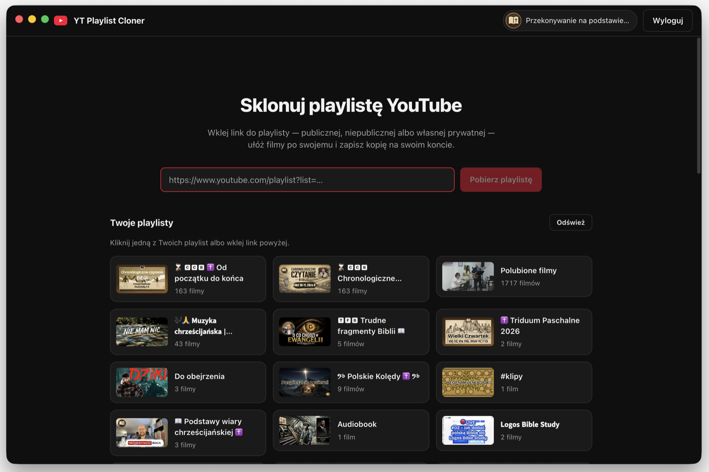
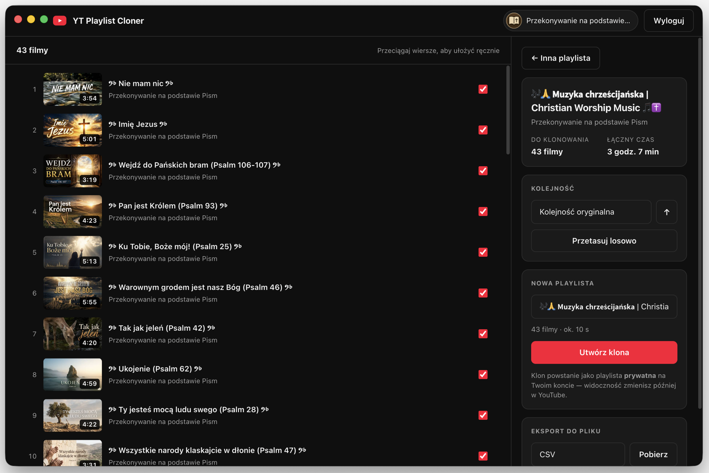

# YT Playlist Cloner

**English** · [Polski](README.pl.md)

A desktop app (Electron) that clones YouTube playlists **without the official Google API** — no
API keys and no daily quota limits. Paste a playlist link, arrange the videos your way (sort,
shuffle, drag to reorder), and save a copy as a new playlist on your account.

The interface is **bilingual**: it shows in Polish on a Polish operating system and in English
everywhere else (detected automatically from your OS language).

## Screenshots

**Home — pick one of your own playlists, or paste a link**



**Reorder, sort or shuffle, then clone to your account**



## Features

- **Fetch playlists without signing in** — public and unlisted playlists are read through
  InnerTube (youtube.com's internal API) with 100-videos-per-page continuation paging.
- **Your own playlists** — after signing in inside the app window, pick any playlist from your
  account directly from a list (no link needed), including your private ones.
- **Sorting** — original order, title, length, channel (locale-aware collation), ascending or
  descending, random shuffle, and manual drag-and-drop ordering.
- **Export to file** — save the playlist as CSV, JSON, or XML: playlist metadata (title,
  description, last-updated date, views, privacy) and the list of videos in the current order
  (title, channel, duration, URL, position, availability). Per-video descriptions and dates are
  not provided by InnerTube in the playlist data, so they are not included.
- **Pick videos** — individual videos can be excluded from the clone; unavailable videos
  (deleted/blocked) are skipped by default.
- **Safe write pacing** — videos are added in batches of 20 with delays and exponential backoff
  to stay clear of InnerTube rate limits (429).
- **In-app sign-in** — the YouTube session lives in a persistent Electron partition
  (`persist:youtube`); nothing is exported or sent anywhere off your computer.

## How it works

The app does not use the YouTube Data API v3. Instead:

1. **Read** — `youtubei.js` queries the `youtubei/v1/browse` endpoint (the same one youtube.com
   uses) and walks the continuation tokens until the whole playlist is fetched.
2. **Sign-in** — the app window opens Google's first-party login page
   (`ServiceLogin?service=youtube`), exactly as ytmdesktop and pear-desktop do. The session
   cookies stay in the Electron partition.
3. **Write** — `youtubei.js` calls `playlist/create` and `browse/edit_playlist` with a
   SAPISIDHASH signature derived from the SAPISID cookie. The order in which videos are added
   determines their order in the new playlist.

## Requirements

- Node.js 20+
- npm

## Running

```bash
npm install
npm run dev        # development mode with HMR
```

Build and type-check:

```bash
npm run typecheck  # type checking (main + renderer)
npm run build      # production build to out/
npm run dist:mac   # .dmg package (macOS)
npm run dist:win   # NSIS installer (Windows)
```

## Limitations

- User playlists have a hard limit of **5000 videos** (a YouTube limit).
- **Mixes** (`RD…` IDs) can't be cloned — they are generated on the fly.
- Deleted or region-blocked videos can't be added to the clone.
- The clone is created as a **private** playlist — change its visibility in YouTube/YouTube Studio.
- Other people's **private** playlists are inaccessible (you clone what your account can see).

## Disclaimer

The app uses YouTube's unofficial, unversioned API (InnerTube) and automates actions on your
account, which formally violates the YouTube Terms of Service. It is intended for personal use at
a reasonable scale (write pacing is intentionally limited). The documented risk for such use is
mainly transient request throttling; you use it at your own risk.

## License

MIT — see [LICENSE](LICENSE).
